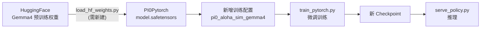

# ACoT-VLA: Action Chain-of-Thought for Vision-Language-Action Models
[](https://arxiv.org/pdf/2601.11404v2)
[](https://huggingface.co/papers/2601.11404)
[](https://creativecommons.org/licenses/by/4.0/)
[](https://opensource.org/licenses/MIT)

This is the **official implementation** of [**ACoT-VLA**](https://arxiv.org/abs/2601.11404v2), a novel paradigm designed to bridge the fundamental semantic-kinematic gap in modern robotic policies. By shifting the locus of reasoning from perception to action, ACoT-VLA enables robots to "think" in the language of actions.

---

## 🌟 Overview

Existing VLA models often rely on indirect reasoning like sub-task prediction (language) or goal image synthesis (vision), which lack the granular information required for precise execution. We posit that the most effective form of reasoning is one that **deliberates directly in the action space**.

### Key Components:

* **Explicit Action Reasoner (EAR):** A light-weight Transformer that synthesizes coarse-grained motion trajectories to provide direct motion cues.

* **Implicit Action Reasoner (IAR):** Extracts latent action priors from the internal representations of the VLM backbone using cross-attention modeling.

* **Action Chain-of-Thought (ACoT):** Together, EAR and IAR co-form an Action Chain-of-Thought, a reasoning paradigm where the deliberative process is formulated as structured action intents, enabling grounded and long-horizon policy learning.

---

## News 

- 🚀🚀 **The [test server](https://agibot-world.com/challenge2026/reasoning2action/quick-start) of AgiBot World Challenge @ ICRA 2026  is available now.**

- 🔥🔥 The minimal version of training code for [AgiBot World Challenge @ ICRA 2026](https://agibot-world.com/challenge2026) - Reasoning to Action track have been released.

- 🚀🚀 The training datasets of [AgiBot World Challenge @ ICRA 2026 - Reasoning to Action track](https://huggingface.co/datasets/agibot-world/AgiBotWorldChallenge-2026/tree/main/Reasoning2Action-Sim) have been released.

---

## 🏆 ICRA 2026 Baseline (AgiBot World Challenge)

This repository serves as the **official baseline implementation** for the **AgiBot World Challenge @ ICRA 2026**.

The competition configuration can be found at:

* **Config Path**: `src/openpi/training/config.py`
* **Config Name**: `acot_icra_simulation_challenge_reasoning_to_action`

---

## 📊 Performance Benchmarks

ACoT-VLA achieves state-of-the-art performance on multiple simulation benchmarks and exhibits superior robustness under distribution shifts.

### 1. LIBERO Benchmark

ACoT-VLA demonstrates significant improvements, particularly in the **LIBERO-Long** suite, by reducing ambiguity in mapping observations to actions.

| Method | Spatial | Object | Goal | Long | **Avg.** |
| --- | --- | --- | --- | --- | --- |
| $\pi_0$ | 96.8 | 98.8 | 95.8 | 85.2 | 94.1 |
| $\pi_{0.5}$ | 98.8 | 98.2 | 98.0 | 92.4 | 96.9 |
| **ACoT-VLA (Frozen)** | **99.4** | **99.6** | 98.8 | 96.0 | **98.5** |
| **ACoT-VLA** | 98.6 | 99.0 | **99.4** | **97.0** | **98.5** |

> *Note: Models are trained on the LIBERO dataset. "Frozen" indicates the LLM backbone is frozen during training. All metrics are average success rates (%). The best results are highlighted in **bold**.*

### 2. LIBERO-Plus Robustness Evaluation

ACoT-VLA shows pronounced robustness under challenging perturbations like camera-viewpoint shifts and sensor noise.

| Setting | Method | Camera | Robot | Language | Light | Background | Noise | Layout | **Avg.** |
| --- | --- | --- | --- | --- | --- | --- | --- | --- | --- |
| **Zero-Shot** | $\pi_0^*$ | 61.0 | 40.8 | 63.5 | 89.3 | 84.1 | 80.1 | 76.4 | 69.4 |
| | $\pi_{0.5}^*$ | **75.8** | 79.4 | 83.3 | 95.5 | 95.0 | **89.6** | 87.0 | 85.7 |
| | **ACoT-VLA (Frozen)** | 68.9 | 80.3 | 84.1 | 95.6 | 93.1 | 81.5 | **88.3** | 83.6 |
| | **ACoT-VLA** | 72.6 | **82.6** | **87.5** | **97.7** | **96.5** | 87.8 | 88.1 | **86.6** |
| **SFT** | $\pi_0$ (Frozen) | 79.6 | 21.1 | 72.5 | 84.7 | 86.2 | 68.3 | 69.4 | 67.4 |
| | $\pi_{0.5}$ (Frozen) | 70.3 | 41.7 | **81.1** | **97.3** | 94.6 | 71.8 | 84.9 | 75.7 |
| | **ACoT-VLA (Frozen)** | 91.2 | 62.5 | 80.3 | 95.1 | 91.5 | 88.3 | 84.9 | 84.1 |
| | **ACoT-VLA** | **96.6** | **70.4** | 79.7 | 95.1 | **97.1** | **95.9** | **85.0** | **88.0** |

> *Note: Methods under **Zero-Shot** are trained on LIBERO and directly evaluated on LIBERO-Plus. **SFT** (Supervised Fine-Tuning) denotes models trained on the LIBERO-Plus training set. An asterisk (\*) denotes results reproduced using officially released checkpoints. "Frozen" indicates the LLM backbone is frozen during training. The best results are highlighted in **bold**.*

### 3. VLABench

Our method delivers substantial gains in unseen-texture tracks and complex tabletop scenarios. Comparison based on **Intention Score (IS)** and **Progress Score (PS)**.

| Method | In-dist. (IS/PS) | Category (IS/PS) | Commonsense (IS/PS) | Instruction (IS/PS) | Texture (IS/PS) | **Avg. (IS/PS)** |
| --- | --- | --- | --- | --- | --- | --- |
| $\pi_0$ (Frozen) | 67.8 / 62.7 | 44.0 / 33.6 | 54.9 / **43.0** | **58.0** / 38.7 | 50.6 / 42.5 | 55.0 / 44.1 |
| $\pi_{0.5}$ (Frozen) | 75.0 / 60.8 | 49.6 / 35.3 | **57.5** / 41.6 | 57.1 / 30.3 | 62.0 / 47.4 | 60.2 / 43.1 |
| **ACoT-VLA (Frozen)** | **79.8 / 66.1** | **54.1 / 38.9** | 52.3 / 37.8 | 56.8 / **39.6** | **74.6 / 54.6** | **63.5 / 47.4** |

> *Note: "Frozen" indicates that the LLM backbone is frozen during training. The best results are highlighted in **bold**.*

---

## 🚀 Get Started

### 1. Installation

We utilize **uv** to manage the Python environment.

```bash
git clone https://github.com/AgibotTech/ACoT-VLA.git
cd ACoT-VLA
git submodule update --init --recursive
GIT_LFS_SKIP_SMUDGE=1 uv sync
GIT_LFS_SKIP_SMUDGE=1 uv pip install -e .

```

### 2. Dataset Preparation

Datasets are processed into the **LeRobot format**.

```bash
python examples/libero/convert_libero_data_to_lerobot.py

```

### 3. Training & Inference

Follow the standardized pipeline to compute normalization statistics and launch training.

```bash
# Compute stats
uv run scripts/compute_norm_stats.py --config-name <CONFIG_NAME>

# Start training
bash scripts/train.sh <CONFIG_NAME> <EXP_NAME>

# Launch policy server
bash scripts/server.sh <GPU_ID> <PORT>

```

---

##  Single-Step Pi0.5 Variant

We provide a **single-step action prediction** variant that replaces the standard 10-step flow matching diffusion with direct action regression. This achieves **~10x faster inference** by performing a single forward pass instead of iterative denoising.

### Architecture

| | Pi0.5 (Standard) | Pi0 Single-Step |
|---|---|---|
| **Inference** | 10-step Euler integration | **1 forward pass** |
| **Training Loss** | Flow matching: `‖v_t - u_t‖²` | L2 regression: `‖predicted - target‖²` |
| **Input** | Noisy actions + timestep | Learnable query tokens |
| **Backbone** | PaliGemma + adaRMS | Same |
| **Speed** | Baseline | **~10x faster** |

### Available Configs

| Config | Model | Data | Finetune |
|---|---|---|---|
| `pi05_single_step_libero` | Pi0SingleStepConfig | LIBERO | Full |
| `pi05_single_step_libero_lora` | Pi0SingleStepConfig | LIBERO | LoRA |
| `pi05_single_step_srb` | Pi0SingleStepConfig | SRB | Full |
| `pi05_single_step_srb_lora` | Pi0SingleStepConfig | SRB | LoRA |
| `debug_single_step` | dummy variants | FakeData | - |

### Usage

```bash
# Compute normalization statistics
uv run python scripts/compute_norm_stats.py --config-name pi05_single_step_libero

# Train
bash scripts/train.sh pi05_single_step_libero my_exp

# Serve (single-step inference)
bash scripts/server.sh 0 8000
```

### Key Notes

- **Weight compatibility**: Cannot directly load pi0.5 pretrained weights (missing time MLP). Use **LoRA finetuning** from `pi05_base` checkpoint instead.
- **Model type**: Reuses `ModelType.PI05` for compatibility with existing training infrastructure.
- **Source**: `src/openpi/models/pi0_single_step.py`

---

## 📅 TODO List

* [x] Release core EAR and IAR training modules.
* [x] Release inference code.
* [x] Training configurations for **LIBERO**, **LIBERO-Plus**, and **VLABench**.
* [x] Official baseline for **AGIBot ICRA Simulation Challenge**.
* [ ] Add training configurations for **CALVIN**.
* [ ] Add training configurations for **RoboCasa**.
* [ ] Release model checkpoints.

---

## 📜 Citation

```bibtex
@article{zhong2026acot,
  title={ACoT-VLA: Action Chain-of-Thought for Vision-Language-Action Models},
  author={Zhong, Linqing and Liu, Yi and Wei, Yifei and Xiong, Ziyu and Yao, Maoqing and Liu, Si and Ren, Guanghui},
  journal={arXiv preprint arXiv:2601.11404},
  year={2026}
}

```

## 🙏 Acknowledgements

This repo is built upon the [OpenPI](https://github.com/Physical-Intelligence/openpi) framework. We sincerely thank the authors for their contributions to the community.

## 研究计划

1. 先将就把 方案B 调通 物理 + meanflow + rl 微调 + 思维链 
  - 1. 怎么应对不同的物理数据维度的缺失 适应不同的数据格式  尽量不要创造新的数据集 只用现有的物理数据集 缺省值默认
2. 接入 gemma 4 2b/4b
3. 对比 pi 0.5 / acot-vla
4. 对比 quart-vla (tokenize)


## openpi

openpi holds open-source models and packages for robotics, published by the [Physical Intelligence team](https://www.physicalintelligence.company/).

Currently, this repo contains three types of models:
- the [π₀ model](https://www.physicalintelligence.company/blog/pi0), a flow-based vision-language-action model (VLA).
- the [π₀-FAST model](https://www.physicalintelligence.company/research/fast), an autoregressive VLA, based on the FAST action tokenizer.
- the [π₀.₅ model](https://www.physicalintelligence.company/blo g/pi05), an upgraded version of π₀ with better open-world generalization trained with [knowledge insulation](https://www.physicalintelligence.company/research/knowledge_insulation). Note that, in this repository, we currently only support the flow matching head for both $\pi_{0.5}$ training and inference.

For all models, we provide _base model_ checkpoints, pre-trained on 10k+ hours of robot data, and examples for using them out of the box or fine-tuning them to your own datasets.

This is an experiment: $\pi_0$ was developed for our own robots, which differ from the widely used platforms such as [ALOHA](https://tonyzhaozh.github.io/aloha/) and [DROID](https://droid-dataset.github.io/), and though we are optimistic that researchers and practitioners will be able to run creative new experiments adapting $\pi_0$ to their own platforms, we do not expect every such attempt to be successful. All this is to say: $\pi_0$ may or may not work for you, but you are welcome to try it and see!

### Updates

- [Sept 2025] We released PyTorch support in openpi.
- [Sept 2025] We released pi05, an upgraded version of pi0 with better open-world generalization.
- [Sept 2025]: We have added an [improved idle filter](examples/droid/README_train.md#data-filtering) for DROID training.
- [Jun 2025]: We have added [instructions](examples/droid/README_train.md) for using `openpi` to train VLAs on the full [DROID dataset](https://droid-dataset.github.io/). This is an approximate open-source implementation of the training pipeline used to train pi0-FAST-DROID. 


### Requirements

To run the models in this repository, you will need an NVIDIA GPU with at least the following specifications. These estimations assume a single GPU, but you can also use multiple GPUs with model parallelism to reduce per-GPU memory requirements by configuring `fsdp_devices` in the training config. Please also note that the current training script does not yet support multi-node training.

| Mode               | Memory Required | Example GPU        |
| ------------------ | --------------- | ------------------ |
| Inference          | > 8 GB          | RTX 4090           |
| Fine-Tuning (LoRA) | > 22.5 GB       | RTX 4090           |
| Fine-Tuning (Full) | > 70 GB         | A100 (80GB) / H100 |

The repo has been tested with Ubuntu 22.04, we do not currently support other operating systems.

### Installation

When cloning this repo, make sure to update submodules:

```bash
git clone --recurse-submodules git@github.com:Physical-Intelligence/openpi.git

# Or if you already cloned the repo:
git submodule update --init --recursive
```

We use [uv](https://docs.astral.sh/uv/) to manage Python dependencies. See the [uv installation instructions](https://docs.astral.sh/uv/getting-started/installation/) to set it up. Once uv is installed, run the following to set up the environment:

```bash
GIT_LFS_SKIP_SMUDGE=1 uv sync
GIT_LFS_SKIP_SMUDGE=1 uv pip install -e .
```

NOTE: `GIT_LFS_SKIP_SMUDGE=1` is needed to pull LeRobot as a dependency.

**Docker**: As an alternative to uv installation, we provide instructions for installing openpi using Docker. If you encounter issues with your system setup, consider using Docker to simplify installation. See [Docker Setup](docs/docker.md) for more details.


### Model Checkpoints

#### Base Models
We provide multiple base VLA model checkpoints. These checkpoints have been pre-trained on 10k+ hours of robot data, and can be used for fine-tuning.

| Model        | Use Case    | Description                                                                                                 | Checkpoint Path                                |
| ------------ | ----------- | ----------------------------------------------------------------------------------------------------------- | ---------------------------------------------- |
| $\pi_0$      | Fine-Tuning | Base [π₀ model](https://www.physicalintelligence.company/blog/pi0) for fine-tuning                | `gs://openpi-assets/checkpoints/pi0_base`      |
| $\pi_0$-FAST | Fine-Tuning | Base autoregressive [π₀-FAST model](https://www.physicalintelligence.company/research/fast) for fine-tuning | `gs://openpi-assets/checkpoints/pi0_fast_base` |
| $\pi_{0.5}$    | Fine-Tuning | Base [π₀.₅ model](https://www.physicalintelligence.company/blog/pi05) for fine-tuning    | `gs://openpi-assets/checkpoints/pi05_base`      |

#### Fine-Tuned Models
We also provide "expert" checkpoints for various robot platforms and tasks. These models are fine-tuned from the base models above and intended to run directly on the target robot. These may or may not work on your particular robot. Since these checkpoints were fine-tuned on relatively small datasets collected with more widely available robots, such as ALOHA and the DROID Franka setup, they might not generalize to your particular setup, though we found some of these, especially the DROID checkpoint, to generalize quite broadly in practice.

| Model                    | Use Case    | Description                                                                                                                                                                                              | Checkpoint Path                                       |
| ------------------------ | ----------- | -------------------------------------------------------------------------------------------------------------------------------------------------------------------------------------------------------- | ----------------------------------------------------- |
| $\pi_0$-FAST-DROID       | Inference   | $\pi_0$-FAST model fine-tuned on the [DROID dataset](https://droid-dataset.github.io/): can perform a wide range of simple table-top manipulation tasks 0-shot in new scenes on the DROID robot platform | `gs://openpi-assets/checkpoints/pi0_fast_droid`       |
| $\pi_0$-DROID            | Fine-Tuning | $\pi_0$ model fine-tuned on the [DROID dataset](https://droid-dataset.github.io/): faster inference than $\pi_0$-FAST-DROID, but may not follow language commands as well                                | `gs://openpi-assets/checkpoints/pi0_droid`            |
| $\pi_0$-ALOHA-towel      | Inference   | $\pi_0$ model fine-tuned on internal [ALOHA](https://tonyzhaozh.github.io/aloha/) data: can fold diverse towels 0-shot on ALOHA robot platforms                                                          | `gs://openpi-assets/checkpoints/pi0_aloha_towel`      |
| $\pi_0$-ALOHA-tupperware | Inference   | $\pi_0$ model fine-tuned on internal [ALOHA](https://tonyzhaozh.github.io/aloha/) data: can unpack food from a tupperware container                                                                                                             | `gs://openpi-assets/checkpoints/pi0_aloha_tupperware` |
| $\pi_0$-ALOHA-pen-uncap  | Inference   | $\pi_0$ model fine-tuned on public [ALOHA](https://dit-policy.github.io/) data: can uncap a pen                                                                                                          | `gs://openpi-assets/checkpoints/pi0_aloha_pen_uncap`  |
| $\pi_{0.5}$-LIBERO      | Inference   | $\pi_{0.5}$ model fine-tuned for the [LIBERO](https://libero-project.github.io/datasets) benchmark: gets state-of-the-art performance (see [LIBERO README](examples/libero/README.md)) | `gs://openpi-assets/checkpoints/pi05_libero`      |
| $\pi_{0.5}$-DROID      | Inference / Fine-Tuning | $\pi_{0.5}$ model fine-tuned on the [DROID dataset](https://droid-dataset.github.io/) with [knowledge insulation](https://www.physicalintelligence.company/research/knowledge_insulation): fast inference and good language-following | `gs://openpi-assets/checkpoints/pi05_droid`      |


By default, checkpoints are automatically downloaded from `gs://openpi-assets` and are cached in `~/.cache/openpi` when needed. You can overwrite the download path by setting the `OPENPI_DATA_HOME` environment variable.


### Running Inference for a Pre-Trained Model

Our pre-trained model checkpoints can be run with a few lines of code (here our $\pi_0$-FAST-DROID model):
```python
from openpi.training import config as _config
from openpi.policies import policy_config
from openpi.shared import download

config = _config.get_config("pi05_droid")
checkpoint_dir = download.maybe_download("gs://openpi-assets/checkpoints/pi05_droid")

# Create a trained policy.
policy = policy_config.create_trained_policy(config, checkpoint_dir)

# Run inference on a dummy example.
example = {
    "observation/exterior_image_1_left": ...,
    "observation/wrist_image_left": ...,
    ...
    "prompt": "pick up the fork"
}
action_chunk = policy.infer(example)["actions"]
```
You can also test this out in the [example notebook](examples/inference.ipynb).

We provide detailed step-by-step examples for running inference of our pre-trained checkpoints on [DROID](examples/droid/README.md) and [ALOHA](examples/aloha_real/README.md) robots.

**Remote Inference**: We provide [examples and code](docs/remote_inference.md) for running inference of our models **remotely**: the model can run on a different server and stream actions to the robot via a websocket connection. This makes it easy to use more powerful GPUs off-robot and keep robot and policy environments separate.

**Test inference without a robot**: We provide a [script](examples/simple_client/README.md) for testing inference without a robot. This script will generate a random observation and run inference with the model. See [here](examples/simple_client/README.md) for more details.


### Fine-Tuning Base Models on Your Own Data

We will fine-tune the $\pi_{0.5}$ model on the [LIBERO dataset](https://libero-project.github.io/datasets) as a running example for how to fine-tune a base model on your own data. We will explain three steps:
1. Convert your data to a LeRobot dataset (which we use for training)
2. Defining training configs and running training
3. Spinning up a policy server and running inference

#### 1. Convert your data to a LeRobot dataset

We provide a minimal example script for converting LIBERO data to a LeRobot dataset in [`examples/libero/convert_libero_data_to_lerobot.py`](examples/libero/convert_libero_data_to_lerobot.py). You can easily modify it to convert your own data! You can download the raw LIBERO dataset from [here](https://huggingface.co/datasets/openvla/modified_libero_rlds), and run the script with:

```bash
uv run examples/libero/convert_libero_data_to_lerobot.py --data_dir /path/to/your/libero/data
```

**Note:** If you just want to fine-tune on LIBERO, you can skip this step, because our LIBERO fine-tuning configs point to a pre-converted LIBERO dataset. This step is merely an example that you can adapt to your own data.

#### 2. Defining training configs and running training

To fine-tune a base model on your own data, you need to define configs for data processing and training. We provide example configs with detailed comments for LIBERO below, which you can modify for your own dataset:

- [`LiberoInputs` and `LiberoOutputs`](src/openpi/policies/libero_policy.py): Defines the data mapping from the LIBERO environment to the model and vice versa. Will be used for both, training and inference.
- [`LeRobotLiberoDataConfig`](src/openpi/training/config.py): Defines how to process raw LIBERO data from LeRobot dataset for training.
- [`TrainConfig`](src/openpi/training/config.py): Defines fine-tuning hyperparameters, data config, and weight loader.

We provide example fine-tuning configs for [π₀](src/openpi/training/config.py), [π₀-FAST](src/openpi/training/config.py), and [π₀.₅](src/openpi/training/config.py) on LIBERO data.

Before we can run training, we need to compute the normalization statistics for the training data. Run the script below with the name of your training config:

```bash
uv run scripts/compute_norm_stats.py --config-name pi05_libero
```

Now we can kick off training with the following command (the `--overwrite` flag is used to overwrite existing checkpoints if you rerun fine-tuning with the same config):

```bash
XLA_PYTHON_CLIENT_MEM_FRACTION=0.9 uv run scripts/train.py pi05_libero --exp-name=my_experiment --overwrite
```

The command will log training progress to the console and save checkpoints to the `checkpoints` directory. You can also monitor training progress on the Weights & Biases dashboard. For maximally using the GPU memory, set `XLA_PYTHON_CLIENT_MEM_FRACTION=0.9` before running training -- this enables JAX to use up to 90% of the GPU memory (vs. the default of 75%).

**Note:** We provide functionality for *reloading* normalization statistics for state / action normalization from pre-training. This can be beneficial if you are fine-tuning to a new task on a robot that was part of our pre-training mixture. For more details on how to reload normalization statistics, see the [norm_stats.md](docs/norm_stats.md) file.

#### 3. Spinning up a policy server and running inference

Once training is complete, we can run inference by spinning up a policy server and then querying it from a LIBERO evaluation script. Launching a model server is easy (we use the checkpoint for iteration 20,000 for this example, modify as needed):

```bash
uv run scripts/serve_policy.py policy:checkpoint --policy.config=pi05_libero --policy.dir=checkpoints/pi05_libero/my_experiment/20000
```

This will spin up a server that listens on port 8000 and waits for observations to be sent to it. We can then run an evaluation script (or robot runtime) that queries the server.

For running the LIBERO eval in particular, we provide (and recommend using) a Dockerized workflow that handles both the policy server and the evaluation script together. See the [LIBERO README](examples/libero/README.md) for more details.

If you want to embed a policy server call in your own robot runtime, we have a minimal example of how to do so in the [remote inference docs](docs/remote_inference.md).


#### More Examples

We provide more examples for how to fine-tune and run inference with our models on the ALOHA platform in the following READMEs:
- [ALOHA Simulator](examples/aloha_sim)
- [ALOHA Real](examples/aloha_real)
- [UR5](examples/ur5)

### PyTorch Support

openpi now provides PyTorch implementations of π₀ and π₀.₅ models alongside the original JAX versions! The PyTorch implementation has been validated on the LIBERO benchmark (both inference and finetuning). A few features are currently not supported (this may change in the future):

- The π₀-FAST model
- Mixed precision training
- FSDP (fully-sharded data parallelism) training
- LoRA (low-rank adaptation) training
- EMA (exponential moving average) weights during training

#### Setup
1. Make sure that you have the latest version of all dependencies installed: `uv sync`

2. Double check that you have transformers 4.53.2 installed: `uv pip show transformers`

3. Apply the transformers library patches:
   ```bash
   cp -r ./src/openpi/models_pytorch/transformers_replace/* .venv/lib/python3.11/site-packages/transformers/
   ```

This overwrites several files in the transformers library with necessary model changes: 1) supporting AdaRMS, 2) correctly controlling the precision of activations, and 3) allowing the KV cache to be used without being updated.

**WARNING**: With the default uv link mode (hardlink), this will permanently affect the transformers library in your uv cache, meaning the changes will survive reinstallations of transformers and could even propagate to other projects that use transformers. To fully undo this operation, you must run `uv cache clean transformers`.

#### Converting JAX Models to PyTorch

To convert a JAX model checkpoint to PyTorch format:

```bash
uv run examples/convert_jax_model_to_pytorch.py \
    --checkpoint_dir /path/to/jax/checkpoint \
    --config_name <config name> \
    --output_path /path/to/converted/pytorch/checkpoint
```

#### Running Inference with PyTorch

The PyTorch implementation uses the same API as the JAX version - you only need to change the checkpoint path to point to the converted PyTorch model:

```python
from openpi.training import config as _config
from openpi.policies import policy_config
from openpi.shared import download

config = _config.get_config("pi05_droid")
checkpoint_dir = "/path/to/converted/pytorch/checkpoint"

# Create a trained policy (automatically detects PyTorch format)
policy = policy_config.create_trained_policy(config, checkpoint_dir)

# Run inference (same API as JAX)
action_chunk = policy.infer(example)["actions"]
```

#### Policy Server with PyTorch

The policy server works identically with PyTorch models - just point to the converted checkpoint directory:

```bash
uv run scripts/serve_policy.py policy:checkpoint \
    --policy.config=pi05_droid \
    --policy.dir=/path/to/converted/pytorch/checkpoint
```

#### Finetuning with PyTorch

To finetune a model in PyTorch:

1. Convert the JAX base model to PyTorch format:
   ```bash
   uv run examples/convert_jax_model_to_pytorch.py \
       --config_name <config name> \
       --checkpoint_dir /path/to/jax/base/model \
       --output_path /path/to/pytorch/base/model
   ```

2. Specify the converted PyTorch model path in your config using `pytorch_weight_path`

3. Launch training using one of these modes:

```bash
# Single GPU training:
uv run scripts/train_pytorch.py <config_name> --exp_name <run_name> --save_interval <interval>

# Example:
uv run scripts/train_pytorch.py debug --exp_name pytorch_test
uv run scripts/train_pytorch.py debug --exp_name pytorch_test --resume  # Resume from latest checkpoint

# Multi-GPU training (single node):
uv run torchrun --standalone --nnodes=1 --nproc_per_node=<num_gpus> scripts/train_pytorch.py <config_name> --exp_name <run_name>

# Example:
uv run torchrun --standalone --nnodes=1 --nproc_per_node=2 scripts/train_pytorch.py pi0_aloha_sim --exp_name pytorch_ddp_test
uv run torchrun --standalone --nnodes=1 --nproc_per_node=2 scripts/train_pytorch.py pi0_aloha_sim --exp_name pytorch_ddp_test --resume

# Multi-Node Training:
uv run torchrun \
    --nnodes=<num_nodes> \
    --nproc_per_node=<gpus_per_node> \
    --node_rank=<rank_of_node> \
    --master_addr=<master_ip> \
    --master_port=<port> \
    scripts/train_pytorch.py <config_name> --exp_name=<run_name> --save_interval <interval>
```

#### Precision Settings

JAX and PyTorch implementations handle precision as follows:

**JAX:**
1. Inference: most weights and computations in bfloat16, with a few computations in float32 for stability
2. Training: defaults to mixed precision: weights and gradients in float32, (most) activations and computations in bfloat16. You can change to full float32 training by setting `dtype` to float32 in the config.

**PyTorch:**
1. Inference: matches JAX -- most weights and computations in bfloat16, with a few weights converted to float32 for stability
2. Training: supports either full bfloat16 (default) or full float32. You can change it by setting `pytorch_training_precision` in the config. bfloat16 uses less memory but exhibits higher losses compared to float32. Mixed precision is not yet supported.

With torch.compile, inference speed is comparable between JAX and PyTorch.

### Troubleshooting

We will collect common issues and their solutions here. If you encounter an issue, please check here first. If you can't find a solution, please file an issue on the repo (see [here](CONTRIBUTING.md) for guidelines).

| Issue                                     | Resolution                                                                                                                                                                                   |
| ----------------------------------------- | -------------------------------------------------------------------------------------------------------------------------------------------------------------------------------------------- |
| `uv sync` fails with dependency conflicts | Try removing the virtual environment directory (`rm -rf .venv`) and running `uv sync` again. If issues persist, check that you have the latest version of `uv` installed (`uv self update`). |
| Training runs out of GPU memory           | Make sure you set `XLA_PYTHON_CLIENT_MEM_FRACTION=0.9` (or higher) before running training to allow JAX to use more GPU memory. You can also use `--fsdp-devices <n>` where `<n>` is your number of GPUs, to enable [fully-sharded data parallelism](https://engineering.fb.com/2021/07/15/open-source/fsdp/), which reduces memory usage in exchange for slower training (the amount of slowdown depends on your particular setup). If you are still running out of memory, you may want to consider disabling EMA.        |
| Policy server connection errors           | Check that the server is running and listening on the expected port. Verify network connectivity and firewall settings between client and server.                                            |
| Missing norm stats error when training    | Run `scripts/compute_norm_stats.py` with your config name before starting training.                                                                                                          |
| Dataset download fails                    | Check your internet connection. For HuggingFace datasets, ensure you're logged in (`huggingface-cli login`).                                                                                 |
| CUDA/GPU errors                           | Verify NVIDIA drivers are installed correctly. For Docker, ensure nvidia-container-toolkit is installed. Check GPU compatibility. You do NOT need CUDA libraries installed at a system level --- they will be installed via uv. You may even want to try *uninstalling* system CUDA libraries if you run into CUDA issues, since system libraries can sometimes cause conflicts. |
| Import errors when running examples       | Make sure you've installed all dependencies with `uv sync`. Some examples may have additional requirements listed in their READMEs.                    |
| Action dimensions mismatch                | Verify your data processing transforms match the expected input/output dimensions of your robot. Check the action space definitions in your policy classes.                                  |
| Diverging training loss                            | Check the `q01`, `q99`, and `std` values in `norm_stats.json` for your dataset. Certain dimensions that are rarely used can end up with very small `q01`, `q99`, or `std` values, leading to huge states and actions after normalization. You can manually adjust the norm stats as a workaround. |


## Gemma 4

Add support for Gemma 4 (2B) and LoRA fine-tuning. The following changes have been made to the codebase:


| 组件 | 状态 | 文件 |
|------|------|------|
| Variant 配置 (`gemma4_300m`, `gemma4_2b`) | ✅ 已定义 | `src/openpi/models/gemma.py:118-143` |
| PyTorch 模型 (`PaliGemma4WithExpertModel`) | ✅ 已实现 | gemma4_pytorch.py |
| `PI0Pytorch` 自动路由 Gemma 4 | ✅ 已实现 | `src/openpi/models_pytorch/pi0_pytorch.py:100-110` |
| Gemma 4 训练配置 | ❌ 缺失 | config.py |
| Gemma 4 预训练权重加载 | ❌ 缺失 | 需要新建 |
| Gemma 4 JAX 实现 | ❌ 不存在 | 无（PyTorch 直接用 HF） |
| JAX→PyTorch 转换脚本 | ❌ 不适用 | Gemma 4 直接用 HF 权重 |

**Gemma 4 vs Gemma 2 关键架构差异**：

| 特性 | Gemma 2 (`gemma_2b`) | Gemma 4 (`gemma4_2b`) |
|------|---------------------|----------------------|
| width | 2048 | **2304** |
| depth | 18 | **30** |
| mlp_dim | 16384 | **9216** |
| num_kv_heads | 1 | **4** (GQA) |
| global_head_dim | 无 | **256** (双 RoPE) |
| 每层 LayerNorm | 2 | **4** + layer_scalar |
| Q/K/V Norm | 无 | **有** |
| 注意力 | 单一 causal | **双掩码** (full + sliding window) |
| 依赖 | transformers_replace 补丁 | **原生支持** (transformers>=5.10) |

---

### 二、训练 Gemma 4 的完整路径

由于 Gemma 4 **没有 JAX 实现**，不能走 JAX→PyTorch 转换路线。正确路径是：



#### 需要做 3 件事：

1. **编写 HuggingFace 权重加载脚本**（从 HF hub 加载 Gemma 4 权重到 `PI0Pytorch`）
2. **新增训练配置**（在 config.py 中添加使用 Gemma 4 variant 的 `TrainConfig`）
3. **正常训练**（train_pytorch.py 不需要改动）

---

### 三、具体实现

#### 改动 1：新增 HuggingFace 权重加载脚本

**load_gemma4_hf_weights.py** — 从 HuggingFace 加载 Gemma 4 预训练权重到 `PI0Pytorch`

#### 改动 2：新增 3 个 Gemma 4 训练配置

在 config.py 的 `_CONFIGS` 中添加了：

| 配置名 | 模型 | 数据集 | 用途 |
|--------|------|--------|------|
| `pi0_aloha_sim_gemma4` | Pi0 + Gemma4 | Aloha Sim | 仿真测试 |
| `pi0_libero_gemma4` | Pi0 + Gemma4 | Libero | Libero 全量微调 |
| `pi05_libero_gemma4` | Pi05 + Gemma4 | Libero | Pi05 模式微调 (adarms) |

#### 改动 3：修复 Gemma 4 模型兼容性

**gemma4_pytorch.py** — 添加了 `to_bfloat16_for_selected_params` 公开方法，与 policy_config.py 的推理加载路径兼容。

---

#### 操作步骤

```bash
# 步骤 1：加载 HuggingFace 预训练权重 → PyTorch checkpoint
# （首次需要 HuggingFace 登录：huggingface-cli login）
python examples/load_gemma4_hf_weights.py \
    --config_name pi0_aloha_sim_gemma4 \
    --output_path ./checkpoints/gemma4_base_pytorch \
    --vlm_model_id google/gemma-4-2b-pt \
    --vision_model_id google/paligemma-3b-mix-448

# 步骤 2：在训练配置中启用 pytorch_weight_path
# 编辑 src/openpi/training/config.py，取消注释：
#   pytorch_weight_path="./checkpoints/gemma4_base_pytorch",

# 步骤 3：开始训练
# 单卡
python scripts/train_pytorch.py pi0_aloha_sim_gemma4 --exp_name gemma4_test

# 多卡
torchrun --standalone --nnodes=1 --nproc_per_node=4 \
    scripts/train_pytorch.py pi0_aloha_sim_gemma4 --exp_name gemma4_test

# 步骤 4：推理
python scripts/serve_policy.py \
    --policy config=pi0_aloha_sim_gemma4,dir=checkpoints/pi0_aloha_sim_gemma4/gemma4_test/20000
```

#### 关键注意事项

1. **Action Expert 随机初始化**：Gemma 4 的动作专家 (300M) 没有预训练权重，从随机初始化开始训练。VLM (2B) 的语言模型和视觉编码器使用预训练权重。

2. **显存需求**：Gemma 4 的 `gemma4_2b` (width=2304, depth=30) 比 Gemma 2 的 `gemma_2b` (width=2048, depth=18) 大不少，建议：
   - 开启梯度检查点（默认已开启）
   - 使用 bfloat16（默认）
   - batch_size 可能需要适当减小

3. **transformers 版本**：Gemma 4 需要 `transformers>=5.10.1`（已在 pyproject.toml 中声明），**不需要** `transformers_replace` 补丁。

4. **Norm Stats**：确保 checkpoint 的 `assets/` 目录下有对应数据集的归一化统计量。如果使用已有数据集（如 Libero），stats 会从 `assets_dir` 自动加载。

5. **LoRA 微调**：目前没有定义 `gemma4_300m_lora` / `gemma4_2b_lora` 变体。如需 LoRA 微调，需要在 gemma.py 的 `get_config()` 中添加对应的 LoRA 配置。

已进行更改。

#### 修改/创建的文件

| 文件 | 修改内容 |
|------|---------|
| lora_pytorch.py | **新建** — 自定义 PyTorch LoRA 实现（LoRAConfig, LoRALinear, inject_lora_linear, freeze_non_lora_params） |
| gemma.py | 添加 `gemma4_300m_lora` (rank=32) 和 `gemma4_2b_lora` (rank=16) 变体 |
| gemma4_pytorch.py | 添加 `inject_lora()` 方法，支持对 VLM 和 Action Expert 分别注入 LoRA |
| pi0_pytorch.py | 更新 `_GEMMA4_VARIANTS`，添加 `_inject_lora()`、`freeze_non_lora_params()`、`count_trainable_params()`、`get_lora_state_dict()` |
| train_pytorch.py | 添加 LoRA 冻结逻辑 + 优化器只接收可训练参数 |
| config.py | 添加 `pi0_libero_gemma4_lora` 和 `pi0_aloha_sim_gemma4_lora` 训练配置 |

#### 训练流程

```
1. 创建 PI0Pytorch(paligemma_variant="gemma4_2b_lora", action_expert_variant="gemma4_300m_lora")
   → 自动注入 LoRA 到 q/k/v/o_proj + gate/up/down_proj
   → action heads (action_in_proj/out_proj/state_proj/time_mlp) 保持可训练

2. 加载预训练权重 (pytorch_weight_path)
   → base weights 从 safetensors 加载，LoRA 层保持随机初始化

3. freeze_non_lora_params()
   → 冻结所有 base weights，仅保留 LoRA A/B + action heads

4. 优化器只接收 requires_grad=True 的参数
   → LoRA rank=16: ~5-8M 可训练参数（vs 全量 ~2B）
```

#### 启动训练

```bash
# 先加载 HF 预训练权重
python examples/load_gemma4_hf_weights.py \
    --config_name pi0_libero_gemma4_lora \
    --output_path ./checkpoints/gemma4_base_pytorch \
    --vlm_model_id google/gemma-4-2b-pt

# LoRA 微调
python scripts/train_pytorch.py pi0_libero_gemma4_lora \
    --exp_name gemma4_lora_libero \
    --pytorch_weight_path ./checkpoints/gemma4_base_pytorch
```

---

### 一、模型架构差异

#### 1. Transformer Layer 结构

| 维度 | Gemma 2 (gemma_pytorch.py) | Gemma 4 (gemma4_pytorch.py) |
|------|------|------|
| **LayerNorm 数量** | 每层 2 个：`input_layernorm` + `post_attention_layernorm` | 每层 4 个：`input_layernorm` + `post_attention_layernorm` + `pre_feedforward_layernorm` + `post_feedforward_layernorm` |
| **残差连接** | `_gated_residual(x, y, gate)` — 可选的门控残差 | 简单加法 `x + y`（无门控残差） |
| **Layer Scalar** | ❌ 无 | ✅ 每层末尾乘 `layer_scalar`（可学习标量，init=1.0） |
| **MLP 前后 Norm** | ❌ MLP 前无额外 norm | ✅ MLP 前后各有 `pre_feedforward_layernorm` 和 `post_feedforward_layernorm` |

**Gemma 2 的单层流程：**
```
input_layernorm → Q/K/V → Attention → gated_residual → post_attention_layernorm → MLP → gated_residual
```

**Gemma 4 的单层流程：**
```
input_layernorm → Q/K/V → Attention → post_attention_layernorm → residual → pre_feedforward_layernorm → MLP → post_feedforward_layernorm → residual → layer_scalar
```

#### 2. 注意力机制

| 维度 | Gemma 2 | Gemma 4 |
|------|---------|---------|
| **Q/K/V Norms** | ❌ 无 | ✅ Q/K 用 `RMSNorm`，V 用 `norm_without_scale` |
| **RoPE** | 单一 RoPE（`theta=10000`） | **双 RoPE**：sliding（`theta=10000`，全旋转）+ full（`theta=1000000`，`partial_rotary_factor=0.25`） |
| **Attention Mask** | 单一因果掩码 | **双掩码**：`full_attention`（全因果）+ `sliding_attention`（滑动窗口，每 5 层用一次） |
| **Layer Types** | 所有层相同 | 每层有 `layer_type`：`"sliding_attention"` 或 `"full_attention"`（5:1 比例） |
| **head_dim** | 单一 `head_dim` | `head_dim=256`（sliding）+ `global_head_dim=256`（我们统一为 256） |

#### 3. KV Head 处理（联合注意力中的关键差异）

**Gemma 2** — VLM 和 Expert 的 `num_kv_heads` 相同（都是 1），直接拼接：
```python
# Gemma 2: 简单拼接
query_states = torch.cat([q1, q2], dim=2)  # 沿 seq 维度
key_states = torch.cat([k1, k2], dim=2)
value_states = torch.cat([v1, v2], dim=2)
```

**Gemma 4** — VLM（`num_kv_heads=4`）和 Expert（`num_kv_heads=1`）不同，需要先扩展：
```python
# Gemma 4: 先扩展 KV heads 到一致，再拼接
if vlm_kv_heads != expert_kv_heads:
    # repeat_kv 扩展较小的 KV heads
    expert_k = repeat_kv(expert_k, 4)  # 1→4
    expert_v = repeat_kv(expert_v, 4)
# 拼接后，再做 GQA 扩展到 num_attention_heads (4→8)
key_states = repeat_kv(key_states, 2)
value_states = repeat_kv(value_states, 2)
```

#### 4. 位置编码（RoPE）计算

**Gemma 2：**
```python
# 统一计算，统一应用
cos, sin = rotary_emb(dummy_tensor, position_ids)
query_states, key_states = apply_rotary_pos_emb(query_states, key_states, cos, sin)
```

**Gemma 4：**
```python
# 按 layer_type 分别计算
for layer_type in ["sliding_attention", "full_attention"]:
    position_embeddings[layer_type] = rotary_emb(hidden_states, position_ids, layer_type)

# 每层根据 layer_type 选择对应的 cos/sin
cos, sin = position_embeddings[layer_type]
# 拼接 Q/K 后再应用 RoPE（因为 position_ids 覆盖完整联合序列）
query_states = torch.cat([vlm_q, expert_q], dim=1)
key_states = torch.cat([vlm_k, expert_k], dim=1)
query_states = apply_rotary_pos_emb(query_states, cos, sin)
key_states = apply_rotary_pos_emb(key_states, cos, sin)
```

#### 5. 模型构建方式

**Gemma 2：**
```python
# PaliGemma 内置 Gemma2 语言模型，直接使用
self.paligemma = PaliGemmaForConditionalGeneration(config=vlm_config_hf)
self.gemma_expert = GemmaForCausalLM(config=action_expert_config_hf)
# adarms 通过 config 传入，由 transformers_replace 自定义层处理
vlm_config_hf.text_config.use_adarms = use_adarms[0]
```

**Gemma 4：**
```python
# PaliGemma 内置的是 Gemma2，需要替换为 Gemma4
self.paligemma = PaliGemmaForConditionalGeneration(config=vlm_config_hf)  # 只用 vision tower
self.gemma4_vlm = Gemma4ForCausalLM(vlm_text_config)  # 独立创建 Gemma4
self.gemma4_vlm.model.embed_tokens = self.paligemma.model.language_model.embed_tokens  # 共享 embedding
# adarms 通过后注入方式添加（保持权重加载兼容性）
_enable_adarms_on_layer(layer, cond_dim)
```

#### 6. PLE（Per-Layer Input）

| | Gemma 2 | Gemma 4 |
|--|---------|---------|
| PLE | ❌ 无 | ✅ 支持（`hidden_size_per_layer_input`） |
| 集成状态 | N/A | 已禁用（`=0`），后续可启用 |

---

### 二、数据推理差异

#### 1. 注意力掩码

**Gemma 2 — 单掩码：**
```python
# pi0_pytorch.py 中准备
att_2d_masks_4d = att_2d_masks[:, None, :, :]
mask = torch.where(att_2d_masks_4d, 0.0, -2.38e38)
```

**Gemma 4 — 双掩码字典：**
```python
# pi0_pytorch.py 中准备
def _prepare_attention_masks_for_gemma4(self, att_2d_masks, sliding_window=512):
    full_mask = ...          # 全因果掩码
    sliding_mask = ...       # 滑动窗口掩码（额外限制窗口外位置）
    return {"full_attention": full_mask, "sliding_attention": sliding_mask}
```

#### 2. 前向传播的三种模式

两者都支持，但内部实现不同：

| 模式 | Gemma 2 | Gemma 4 |
|------|---------|---------|
| **VLM-only**（前缀缓存） | `paligemma.language_model.forward(...)` | `gemma4_vlm.model.forward(...)` |
| **Expert-only**（后缀） | `gemma_expert.model.forward(...)` | `gemma4_expert.model.forward(...)` |
| **Joint**（联合注意力） | 内部调用 `transformers_replace` 自定义层 | 手动实现 `_forward_joint()` |

#### 3. 联合注意力中的 Q/K/V 处理顺序

**Gemma 2：**
```
各模型独立: input_layernorm(带adarms) → Q/K/V proj → transpose(1,2) → 沿seq拼接 → RoPE → Attention → split → o_proj → _gated_residual
```

**Gemma 4：**
```
各模型独立: input_layernorm → Q/K/V proj → Q/K/V norms → expand KV heads
联合: 沿seq拼接 → RoPE → GQA expand (4→8) → Attention → split → o_proj → post_attn_norm → residual
```

**关键区别**：Gemma 4 在 Q/K/V 投影后立即做 Q/K/V norms，然后再拼接和计算注意力。

#### 4. Embedding 访问路径

**Gemma 2：**
```python
embed_tokens = self.paligemma.language_model.embed_tokens  # 直接访问
```

**Gemma 4：**
```python
embed_tokens = self.paligemma.model.language_model.embed_tokens  # 多一层 .model
# 因为 transformers 5.x 中 PaliGemma 结构变化
```

#### 5. Precision 保持的参数范围

**Gemma 2 保持 float32 的参数：**
```python
["input_layernorm", "post_attention_layernorm", "model.norm"]
```

**Gemma 4 保持 float32 的参数（更广）：**
```python
["input_layernorm", "post_attention_layernorm", 
 "pre_feedforward_layernorm", "post_feedforward_layernorm",  # 新增
 "model.norm"]
```

#### 6. adarms (PI05) 实现方式

**Gemma 2** — 通过 `transformers_replace` 自定义的 `GemmaRMSNorm`，在 config 中声明：
```python
vlm_config_hf.text_config.use_adarms = True
vlm_config_hf.text_config.adarms_cond_dim = width
# 自定义层根据 config 自动创建 adarms dense
```

**Gemma 4** — 通过后初始化注入，替换 norm 的 forward 方法：
```python
def _enable_adarms_on_layer(layer, cond_dim):
    norm.adarms_dense = nn.Linear(cond_dim, dim * 3)
    norm.forward = types.MethodType(_adarms_norm_forward, norm)
# 不修改层结构，保持权重加载兼容性
```

---

### 三、总结

| 维度 | Gemma 2 | Gemma 4 |
|------|---------|---------|
| **每层 Norm 数** | 2 | 4 |
| **Q/K/V Norms** | ❌ | ✅ |
| **RoPE** | 单一 | 双重（sliding + full） |
| **Attention Mask** | 单一 | 双重（full + sliding window） |
| **Layer Scalar** | ❌ | ✅ |
| **残差方式** | 门控残差 | 简单加法 |
| **PLE** | ❌ | ✅（已禁用） |
| **KV Head 匹配** | 直接拼接 | repeat_kv 扩展 + GQA |
| **adarms 实现** | config 声明式 | 后初始化注入式 |
| **transformers 依赖** | 需要 `transformers_replace` 自定义层 | 原生支持（transformers 5.x） |
| **Embedding 路径** | `paligemma.language_model.embed_tokens` | `paligemma.model.language_model.embed_tokens` |

### PLE (Per-Layer Embeddings) 详解

**PLE = Per-Layer Embeddings（逐层嵌入）**，是 Gemma 4 引入的一种新的辅助信息注入机制。

#### 核心思想

传统 Transformer 只在第 0 层通过 token embedding 输入信息，之后所有层都只处理上一层的 hidden state。PLE 打破了这个限制——**给每一层都注入一个额外的辅助信号**。

#### 数据流（当 PLE 启用时）

```
token_ids ──→ embed_tokens_per_layer ──→ token_identity  (形状: [B, T, num_layers, ple_dim])
                                              ↓
inputs_embeds ──→ per_layer_model_projection ──→ context_projection
                                              ↓
                              (context + token_identity) × 1/√2
                                              ↓
                                    per_layer_inputs [B, T, 30, 256]
                                              ↓
                              ┌───────────────┼───────────────┐
                              ↓               ↓               ↓
                          Layer 0         Layer 1    ...    Layer 29
                       ple[:,:,0,:]     ple[:,:,1,:]     ple[:,:,29,:]
```

#### 每层的注入方式（在 `Gemma4TextDecoderLayer.forward` 中）

```python
# 第 i 层拿到属于自己的那一片 per_layer_input = ple[:, :, i, :]

if self.hidden_size_per_layer_input:
    residual = hidden_states
    hidden_states = self.per_layer_input_gate(hidden_states)   # Linear gate
    hidden_states = self.act_fn(hidden_states)                 # 激活函数
    hidden_states = hidden_states * per_layer_input            # ← 与 PLE 逐元素相乘
    hidden_states = self.per_layer_projection(hidden_states)   # 再投影
    hidden_states = self.post_per_layer_input_norm(hidden_states)
    hidden_states = residual + hidden_states                   # 残差连接
```

这是一个**门控乘法机制**：
1. 用当前 hidden state 计算一个 gate
2. gate 与 PLE 逐元素相乘（注意力风格的软选择）
3. 投影后作为残差加回去

#### PLE 的两部分信号

| 组件 | 来源 | 含义 |
|------|------|------|
| **token_identity** | `embed_tokens_per_layer(token_ids)` | token 本身的逐层语义（类似"每个 token 对每层该说什么"） |
| **context_projection** | `Linear(inputs_embeds)` | 上下文感知的投影（当前序列的全局信息） |

两者相加后，每个 token 在每一层都有一个 256 维的独立辅助向量。

#### 为什么禁用？

| 原因 | 说明 |
|------|------|
| **显存开销大** | 额外的 `embed_tokens_per_layer` 表：`262144 × 7680`（约 2GB fp32），加上每层的 gate/投影参数 |
| **推理计算量** | 每层多一次 gate + 投影前向，30 层累计不可忽略 |
| **PI0 场景收益不确定** | 机器人策略任务是视觉-动作映射，不是通用语言建模，PLE 的逐层调制能力未必有用 |
| **复杂度优先** | 集成第一步追求简洁稳定，PLE 可以后续按需启用 |
| **Google 官方 4B 也未使用** | Gemma 4 的 4B 版本 `hidden_size_per_layer_input=256`（默认值），但我们当前配置设为 0 禁用 |

#### 如何启用（如果未来需要）

在 pi0_config.py 中为 Gemma 4 模型配置设置：
```python
hidden_size_per_layer_input=256,        # 启用 PLE，维度 256
vocab_size_per_layer_input=262144,      # PLE 词表大小
```

这样 `Gemma4TextModel` 就会自动创建 PLE 相关的嵌入表和投影层，每一层都会收到属于自己的 256 维辅助信号。


已完成 PyTorch 版本的 GRPO 微调脚本。创建了以下文件：

**train_pytorch.py** — PyTorch GRPO 训练主脚本，核心特性：
- 支持 DDP 多 GPU 分布式训练（`torchrun` 启动）
- `compute_rl_loss()` — 实现 advantage-weighted flow matching loss，将 GRPO 优势值作为 flow matching MSE 损失的权重
- 完整的 checkpoint 管理（保存/恢复 epoch、best model、optimizer 状态）
- Cosine decay + warmup 学习率调度
- 复用现有的 `grpo_algo`（优势估计）、`reward_manager`（奖励计算）、`env_runner`（环境交互）

**run_rl_train_pytorch.sh** — 启动脚本，支持单卡和多卡模式

使用方式：
```bash
# 单卡
python -m RLtune.train_pytorch --config_name srb_train \
    --checkpoint_dir path/to/sft_ckpt

# 多卡 DDP
bash RLtune/run_rl_train_pytorch.sh srb_train path/to/sft_ckpt --multi_gpu

# 自定义超参
bash RLtune/run_rl_train_pytorch.sh srb_train path/to/sft_ckpt \
    --n_samples 16 --learning_rate 1e-5 --total_epochs 50
```

> **注意**：当前 PyTorch 版本基于 `PI0Pytorch` 模型。若需要 ACoT-VLA 双专家架构的 PyTorch 版本，需要额外实现 ACoT-VLA 的 PyTorch 模型类（目前仅有 JAX 版本 acot_vla.py），然后在 `build_model()` 中替换即可。


### 新增方法

| 方法 | 作用 |
|---|---|
| `compute_one_step_velocity` | 在 t=0 处评估速度场（NFE=1），返回 coarse/fine velocity |
| `sample_actions_one_step` | **一键推理**：`action = z_0 + u(z_0, t=0\|o)`，支持可选探索噪声 |
| `compute_self_consistency_loss` | 训练时的路径压缩损失，鼓励速度场沿流路径一致 |

### 新增配置参数（`ACOTConfigPytorch`）

```python
use_one_step_inference: bool = False      # 是否默认使用 one-step 推理
exploration_std: float = 0.0              # 探索噪声标准差
self_consistency_loss_scale: float = 0.0  # SC 损失权重
sc_midpoint_samples: int = 1              # SC 损失采样点数
```

### 核心区别

- **多步推理**（原 `sample_actions`）：循环 N 次 Euler ODE 步，每次 NFE=1，总 NFE=num_steps
- **一步推理**（新 `sample_actions_one_step`）：仅在 t=0 处评估一次速度场，直接 `action = noise + velocity`，**NFE=1**，速度提升约 `num_steps` 倍

### 使用方式

```python
# 推理
result = model.sample_actions_one_step(device, observation, exploration_std=0.01)

# 训练时启用 SC 损失
config = ACOTConfigPytorch(
    self_consistency_loss_scale=0.1,
    sc_midpoint_samples=2,
)
# 在 training loop 中:
sc_loss = model.compute_self_consistency_loss(observation, actions, coarse_actions)
total_loss = flow_matching_loss + config.self_consistency_loss_scale * sc_loss
```


